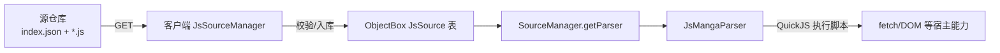

# 动态 JS 漫画源（方案三）

本项目支持通过 **QuickJS 引擎**在线加载/更新 JS 脚本形式的漫画源，无需重新发版 APK。
脚本从"源仓库"（HTTP 服务器上的一组 `.js` 文件 + `index.json` 清单）拉取并缓存在本地。

## 原理



- 脚本在 **QuickJS** 中解释执行（与内置源 `DecryptionUtils.evalDecrypt` 同一引擎）。
- 每次解析调用都会创建独立引擎实例（评估 SDK + 脚本 → 调用函数 → 释放），因此
  `JsMangaParser` 可被多线程安全共享。
- 宿主能力（HTTP、DOM 解析、摘要等）通过 C 层的 `hostCall` 桥回调到 Java 实现。

## 使用方式

1. 在"源管理"页右上角菜单中：
   - **源仓库地址**：输入仓库根地址（例如 `https://your-server.com/sources`，
     客户端会请求 `{地址}/index.json`）
   - **更新源**：拉取清单、下载变更的脚本、校验后入库
2. 安装的 JS 源出现在源列表中，可像内置源一样启用/禁用。
   与内置源同 `type` 的 JS 源启用后会**覆盖**内置实现。
3. App 升级（`UpdateHelper` 按版本号同步源表）时，JS 源对应的记录不会被误删。

> 自带数据同步服务器的托管方式：把脚本放进 `data_server/sources/`，服务端自动在
> `/sources` 路径静态托管（可配置 `sources.dir` / 环境变量 `SOURCES_DIR`）。

## 脚本结构

每个源是一个独立的 `.js` 文件，必须：

1. 定义全局常量 `SOURCE`（元数据）；
2. 实现必需的函数（请求构建 + 解析）。

### SOURCE 元数据

> ⚠️ `SOURCE` 必须用 `var` 声明（全局 `var`/函数声明会成为全局对象属性，引擎用
> `JS_GetPropertyStr` 读取；`const`/`let` 是全局词法绑定，读不到会导致元数据失效）。

```js
var SOURCE = {
    type: 900,                     // 必需：唯一类型号（int，>0，勿与内置源冲突）
    title: '示例源',               // 必需：源名称
    baseUrl: 'https://example.com',// 必需：源根地址（用于拼默认 URL）
    hosts: ['example.com'],        // 可选：用于外链识别（isHere）
    cidRegex: '(\\d+)',            // 可选：从 URL 提取 cid 的正则，默认 (\\d+)
    cidGroup: 1,                   // 可选：提取分组，默认 1
    webConfig: {                   // 可选：WebView 渲染配置（同内置源的 WebParserConfig）
        search:     { useWebParser: false, autoScroll: false, injectJs: '', handleCloudflare: true, cloudflareTimeoutMs: 30000, interactiveChallenge: false },
        info:       { useWebParser: false },
        chapter:    { useWebParser: false },
        images:     { useWebParser: false },
        imagesLazy: { useWebParser: false }
    },
    categories: {                  // 可选：分类
        composite: false,
        format: 'https://example.com/list/{subject}-{area}-p{page}',  // 占位符见下
        subject:  [{ title: '全部', value: '' }, { title: '热血', value: 'hot' }],
        area:     [{ title: '全部', value: '' }],
        reader:   [], progress: [], year: [], order: []
    }
};
```

`categories.format` 的占位符：
`{subject}` `{area}` `{reader}` `{progress}` `{year}` `{order}` `{page}`。
其中 `{page}` 会被替换为页码，其余被替换为用户所选选项的 `value`。
**不要**在 format 里使用 `%` 字符（不做 `String.format` 处理）。

### 必需函数

所有函数在**请求构建**与**解析**两类中各三件套：

| 函数 | 入参 | 返回 |
|---|---|---|
| `getSearchRequest(keyword, page)` | 关键字、页码 | 请求描述或 `null` |
| `parseSearch(html, page)` | 页面 HTML、页码 | `[{cid,title,cover,update,author}]` |
| `getInfoRequest(cid)` | 漫画 id | 请求描述 |
| `parseInfo(html, cid)` | HTML、cid | `{title,cover,update,intro,author,finish,chapters?}` |
| `getImagesRequest(cid, path)` | 漫画 id、章节路径 | 请求描述 |
| `parseImages(html)` | 章节页 HTML | `[url]` 或 `[{url,lazy}]` |

请求描述：

```js
{
    url: 'https://...',                    // 必需
    method: 'GET',                          // 可选：GET / POST
    headers: { Referer: 'https://...' },    // 可选：请求头
    body: null                              // POST 时：字符串，或对象（表单字段）
}
```

### 可选函数

| 函数 | 说明 |
|---|---|
| `getChapterRequest(html, cid)` / `parseChapter(html)` | 详情页不含章节列表时使用 |
| `getLazyRequest(url)` / `parseLazy(html, url)` | 图片惰性加载（返回图片 URL 字符串） |
| `getCheckRequest(cid)` / `parseCheck(html)` | 更新检查（不实现时回退到详情） |
| `getHeader()` | 返回 `{ 'User-Agent': '...', 'Referer': '...' }` |
| `getUrl(cid)` | 返回漫画详情页 URL（默认 `baseUrl + "/" + cid`） |
| `getCategoryRequest` / `parseCategory(html, page)` | 有 `categories` 元数据时可实现 |

### 引擎内置 SDK

脚本可直接使用的全局能力：

- `fetch(url, options)` → `{status, body, headers}`：同步 HTTP 请求；
  `options = {method, headers, body}`。网络层错误会抛异常，HTTP 非 2xx 不抛（用 `status` 判断）。
- `DOM(html)`：CSS 选择器解析对象：
  - `dom.select(css)` → `[node]`，`node` 提供 `text()/attr(name)/href()/src()/dataUrl()/html()/select(css)`
  - `dom.text(css)` / `dom.attr(css,name)` / `dom.src(css)` / `dom.href(css)` / `dom.html()`
- `selectAll(html, css)` → 节点数组（`DOM` 的底层）
- `evalDecrypt(code)`：执行任意 JS 表达式并返回结果
- `LZ64Decrypt(str)`：LZString base64 解压（等价内置 `DecryptionUtils.LZ64Decrypt`）
- `getNumber(s)`：提取第一段连续数字
- `md5(s)` / `urlEncode(s)` / `urlDecode(s)` / `base64Encode(s)` / `base64Decode(s)`
- `atob` / `btoa` / `console.log` / `print`（引擎内置）

## 安全与限制

- 脚本运行在 QuickJS 沙箱：**无文件系统/进程访问**，内存上限 32MB，单次执行超时 10s，
  调用栈上限 512KB。
- 脚本只能通过 `fetch` 访问网络，无法直接读取本地数据。
- **请只从可信的源仓库安装脚本**——恶意脚本理论上仍可通过 `fetch` 窃取当前设备 IP
  可见的信息，或发起网络请求（与内置源行为等价，无额外越权）。

## 调试

- 脚本内 `console.log(...)` 会输出到 logcat（tag `QuickJS`）。
- 脚本执行错误会经 `JsSourceException` 冒泡，`parseXxx` 失败时源管理器有对应错误提示。
- 校验失败（缺少必需函数/语法错误）时，`index.json` 更新会中止并提示具体原因。
